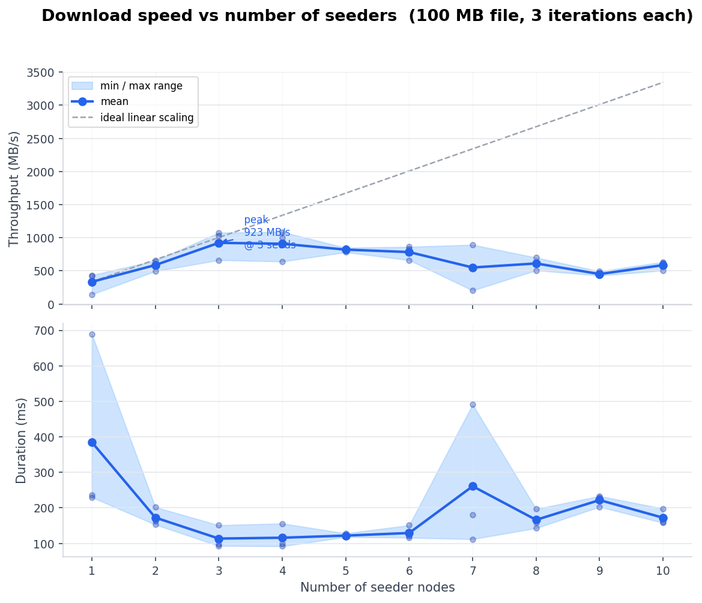

# TorrentFileSharing

A local peer-to-peer file-sharing system built in Java. Nodes discover files by keyword, then download them in parallel blocks from every peer that has the file — no central server required.

---

## Table of Contents

- [How It Works](#how-it-works)
- [Project Layout](#project-layout)
- [Requirements](#requirements)
- [Running a Single Node](#running-a-single-node)
- [Running Tests](#running-tests)
- [Running the Benchmark](#running-the-benchmark)
- [Adding Files to a Node](#adding-files-to-a-node)
- [Architecture Notes](#architecture-notes)
- [Troubleshooting](#troubleshooting)
- [License](#license)

---

## How It Works

Each node runs a TCP server on port `8080 + nodeId`. Nodes connect to each other manually (via the GUI or programmatically). Once connected, the following flow is available:

**Search → Download**

1. A node broadcasts a `WordSearchMessage` containing a keyword to all its peers.
2. Each peer scans its local folder for files whose name matches the keyword and replies with a `FileSearchResult[]` array (file name, SHA-256 hash, size, address, port).
3. The searching node displays the results. The user selects files and clicks Download.
4. A `DownloadTasksManager` splits the file into fixed-size blocks and spawns one `DownloadAssistant` per seeder. Assistants send `FileBlockRequestMessage`s; seeders reply with `FileBlockAnswerMessage`s containing the raw data, which is written directly to disk at the correct offset.
5. Blocks are distributed across all available seeders in parallel. If a seeder drops mid-download, its remaining blocks are re-assigned to another peer.

Files are identified by their SHA-256 hash, which prevents duplicate downloads and allows integrity checking.

---

## Project Layout

```
TorrentFileSharing/
├── Code/
│   ├── src/
│   │   ├── Core/
│   │   │   ├── Node.java              # Central node: peers, download managers, server
│   │   │   ├── NodeListener.java      # Callback interface (decouples Node from GUI)
│   │   │   └── Utils.java             # SHA-256 hashing, IP discovery, port validation
│   │   ├── GUI/
│   │   │   ├── GUI.java               # Main window — implements NodeListener
│   │   │   ├── GUINode.java           # "Connect to node" dialog
│   │   │   └── GUIDownloadProgress.java  # Per-download progress window
│   │   ├── Services/
│   │   │   ├── SubNode.java           # Per-connection thread (send/receive messages)
│   │   │   ├── DownloadTasksManager.java # Orchestrates parallel block downloads
│   │   │   ├── DownloadAssistant.java # Worker: requests blocks from one seeder
│   │   │   └── SenderAssistant.java   # Worker: serves block requests to peers
│   │   ├── Messaging/
│   │   │   ├── BinaryProtocol.java    # Wire helpers (strings, byte arrays, InetAddress)
│   │   │   ├── NewConnectionRequest.java
│   │   │   ├── FileBlockRequestMessage.java
│   │   │   └── FileBlockAnswerMessage.java
│   │   ├── FileSearch/
│   │   │   ├── FileSearchResult.java  # File metadata + serialization
│   │   │   └── WordSearchMessage.java # Keyword query message
│   │   └── Tests/
│   │       ├── Main.java              # Interactive single-node launcher
│   │       ├── Test.java              # Multi-node test scenarios
│   │       └── Benchmark.java         # Speed benchmark (1→N seeders, CSV output)
│   └── bin/                           # Compiled .class files (generated)
├── files/
│   ├── dl1/                           # Seed files for node 1
│   ├── dl2/                           # Seed files for node 2
│   └── ...
├── run_project.sh                     # Compile + run a single node
└── test_project.sh                    # Compile + run multi-node test scenarios
```

At runtime, each node works out of `Code/files/dl{id}/`. The scripts copy the matching `files/dl{id}/` contents there on startup.

---

## Requirements

- Java JDK 17 or newer (uses switch expressions and records)
- Bash-compatible shell

```bash
java -version
javac -version
```

---

## Running a Single Node

```bash
./run_project.sh
```

Enter a node ID when prompted (e.g. `1`). The node listens on port `8081` and opens the GUI. Use the **Connect to Node** button to link it to another running node by entering its address and port.

---

## Running Tests

```bash
./test_project.sh
```

Enter one or more node IDs separated by spaces (e.g. `1 2 3`), then choose a scenario:

| Mode | Description |
|------|-------------|
| 0 | Create nodes only |
| 1 | Create nodes and connect them |
| 2 | Connect nodes, search from the first node |
| 3 | Connect nodes, search from all nodes |
| 4 | Connect nodes, search, download in the last node |
| 5 | Connect nodes, search, download in every node |

Nodes run headlessly (no visible window) so multiple can share a screen. Each node pre-loads its files from the matching `files/dl{id}/` folder.

---

## Running the Benchmark

Measures download throughput as the number of seeders grows from 1 to N. All nodes run headlessly in the same JVM.

```bash
java -cp Code/bin Tests.Benchmark [maxSeeds] [iterations] [fileSizeBytes] [outputCsv]
```

Defaults: 10 seeds, 3 iterations, 100 MB file, output to `benchmark/benchmark_results.csv`. Results are also written to a console summary table.

To regenerate the graph after a run:

```bash
python benchmark/build_graph.py
```

### Results

> Measured on a MacBook M1 Air 8 GB, loopback · 100 MB file · 3 iterations per seed count.



---

## Adding Files to a Node

1. Create (or update) `files/dl{id}/` in the repository root.
2. Place any files inside it.
3. Re-run `./run_project.sh` or `./test_project.sh` — the script copies the folder to `Code/files/dl{id}/` before starting.

To add files while a node is already running, drop them directly into `Code/files/dl{id}/`. They become available for search immediately; the hash is computed on first request and cached.

---

## Architecture Notes

### NodeListener

`Core.NodeListener` is an interface implemented by `GUI`. `Node` and its services (`SubNode`, `DownloadTasksManager`) only ever hold a `NodeListener` reference — they never import anything from the `GUI` package. This means:

- No circular dependency between `Core`/`Services` and `GUI`
- Headless operation requires nothing from Swing — just pass an alternative `NodeListener` (like `BenchmarkNodeListener`)
- GUI can be swapped or mocked trivially in tests

### Binary Protocol

All messages are framed as `[1-byte typeId][4-byte payload length][payload]`. `BinaryProtocol` provides helpers for writing and reading strings, byte arrays, and `InetAddress` objects. The fixed-width framing makes it possible to multiplex multiple message types over a single TCP stream without delimiters.

### Port vs. OS Ephemeral Ports

When node A connects to node B's server, the OS assigns A a random high port for that socket. `SubNode` exchanges a `NewConnectionRequest` on connect so each side learns the peer's *true* server port (e.g. `8082` for node ID 2). This original port is what gets stored in `FileSearchResult` and matched in `DownloadTasksManager.getNodesWithFile()`.

### Parallel Download

`DownloadTasksManager` divides a file into fixed-size blocks and spawns one `DownloadAssistant` thread per seeder. Assistants pull from a shared `requestList`; completed blocks are written directly to the destination file via `RandomAccessFile.seek()`. A `CountDownLatch` tracks completion. If a seeder disconnects mid-download, its remaining blocks are reassigned to a surviving peer.

---

## Troubleshooting

**`Permission denied` when running a script:**
```bash
chmod +x run_project.sh test_project.sh
```

**Compilation fails:**
Confirm `javac` is installed and points to JDK 17+. The source files in `Code/src/` must all compile together in a single `javac` invocation (the scripts handle this).

**"Default file structure not found":**
The `files/` directory must exist at the repository root. Create it and add at least one `dl{id}/` subfolder.

**Node can't connect to another node:**
Check that both nodes are running and that the port matches `8080 + nodeId`. Firewalls or VPNs on the local network can block the connection.

**Search returns no results:**
The keyword must appear as a substring of the file name (case-insensitive). Confirm the target node has files in its `Code/files/dl{id}/` folder.

---

## License

This project is licensed under the MIT License.
